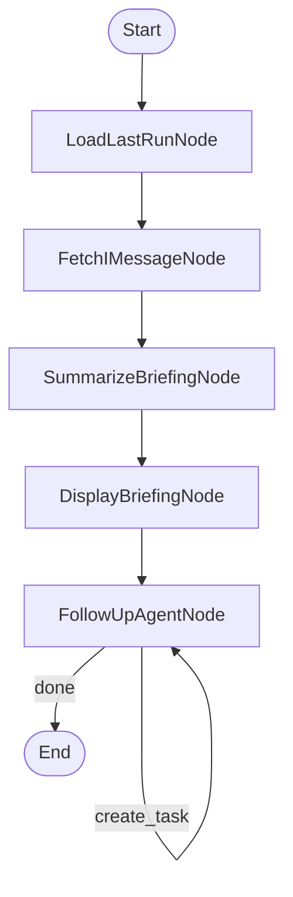
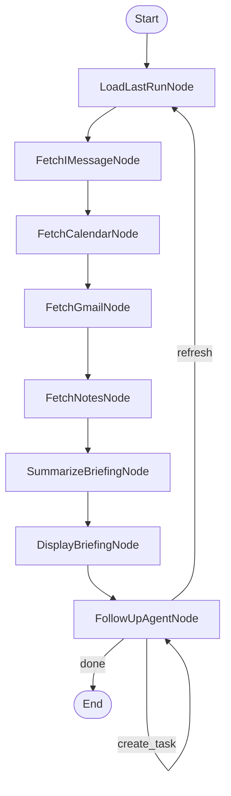

# Design Doc: Life Admin Morning Briefing Agent

> AI NOTE: Read this entire document before writing any code. Start simple. Ask for clarification if any node's behavior is ambiguous. Do not implement all nodes at once — build and test incrementally. **v0.1 scope is iMessage only.** All other sources are documented for future versions but should NOT be built yet.

-----

## Requirements

Hank is a data engineer who finds life admin distracting. He wants a single system that aggregates his communications and obligations from across his digital life, synthesizes them into a prioritized morning briefing, and then lets him interact with that briefing conversationally — asking follow-up questions, drafting replies, and creating new tasks.

**User story (v0.1):** Hank runs the agent from his terminal each morning. The agent reads his recent iMessages (since the last briefing), summarizes them into a structured briefing highlighting messages that need a response, open questions people have asked him, and conversation threads he should follow up on. Hank reads the briefing and can then ask follow-up questions like "What exactly did Sarah say about Saturday?" or "Draft a reply to Mom telling her I'll be there at 6." The agent answers using the raw message data it already collected. When Hank is done, he types "done" and the session ends.

**User story (v1.0):** Same as above, but the briefing pulls from all four sources — iMessage, Google Calendar, Gmail, and Apple Notes — and synthesizes them into a unified daily briefing. The follow-up agent can draft email replies, text message replies, and create new task items.

**Non-goals (all versions):**
- No autonomous sending of messages or emails without user seeing the draft
- No modifying or deleting source data (read-only access to all sources)
- No real-time monitoring or push notifications — this is a pull-based system the user runs on demand
- No web UI (CLI only through v1.0)

-----

## Versioned Roadmap

### v0.1 — iMessage Briefing (current scope)
- Read iMessages from local SQLite DB since last briefing
- Summarize into structured morning briefing
- Conversational follow-up agent (answer questions about messages, draft text replies)
- Persist last-briefing timestamp between runs

### v0.2 — Add Google Calendar
- Fetch today's events + next 48 hours via Google Calendar API
- Include upcoming schedule in the briefing
- Follow-up agent can answer schedule questions ("Am I free at 3pm?")

### v0.3 — Add Gmail
- Fetch unread + flagged/starred emails via Gmail API
- Include email summaries and action-required flags in the briefing
- Follow-up agent can draft email replies

### v0.4 — Add Apple Notes
- Read recent notes from local SQLite DB
- Surface notes that contain to-do items, checklists, or action language
- Include in briefing as "open tasks from Notes"

### v0.5 — Enhanced Follow-up Agent
- Draft replies for both email and iMessage from the follow-up agent
- Create new task items (output as structured text for v0.5; future versions may integrate with a task manager)
- Refresh briefing mid-session ("refresh" command re-pulls from all sources)

### v1.0 — Unified CLI Briefing
- All four sources active and synthesized into one briefing
- Polished CLI output formatting
- Robust error handling per source (one source failing doesn't block others)
- Configurable lookback windows per source

### Phase 2 (future — not designed here)
- **Brain dump processor:** User can type a free-form text blurb ("email landlord about the leak, dentist next week, follow up with Sarah about dinner") and the agent parses it into discrete action items, classifies each by type (email, calendar event, task, reminder), drafts the appropriate output for each, and presents everything for review before finalizing. This is the "write" complement to v1.0's "read" system. The existing follow-up agent's reply-drafting capability is a stepping stone toward this.
- **Local web UI:** Replace CLI with a localhost web interface for the briefing and follow-up interaction.

-----

## Design Pattern

**Primary:** Workflow (briefing pipeline) → Agent (conversational follow-up)

The system has two distinct phases that run sequentially:

1. **Briefing Workflow** — a deterministic pipeline that collects data from sources, summarizes it, and presents the briefing. This is a classic PocketFlow Workflow: a chain of nodes that each do one thing.

2. **Follow-up Agent** — an interactive decision loop where the user asks questions and the agent decides what action to take (answer from context, draft a reply, create a task, or exit). This is the PocketFlow Agent pattern: a node that loops, choosing its next action each iteration.

-----

## Flow Design

### High-Level Description

1. **LoadLastRunNode** — Reads the last-briefing timestamp from a local file. If no file exists (first run), defaults to 24 hours ago.
2. **FetchIMessageNode** — Queries the local iMessage SQLite database for all messages since the last-briefing timestamp. Returns raw message data including sender, timestamp, message body, and conversation thread context.
3. **SummarizeBriefingNode** — Takes all raw source data and uses the LLM to produce a structured morning briefing. Groups information by priority: action-required items first, then informational updates, then low-priority FYI items.
4. **DisplayBriefingNode** — Formats and prints the briefing to the terminal. No LLM call. Saves the current timestamp as the new last-briefing time.
5. **FollowUpAgentNode** — Enters an interactive loop. Reads user input, decides the appropriate action (answer question, draft reply, create task, or exit), executes that action, and loops back for the next input.

### Flow Diagram (v0.1)



### Flow Diagram (v1.0 — for reference, do not build yet)



> **Note on v1.0 diagram:** The four fetch nodes run sequentially in a chain. Each one writes its data to the shared store independently. If a source fails (e.g., Gmail API is down), the node's exec_fallback returns an empty list and the chain continues. Parallel execution via PocketFlow's Parallel pattern is an optional optimization — sequential is fine for four quick data fetches.

-----

## Utility Functions

> AI NOTE: For v0.1, only implement utilities #1, #2, #3, and #4. The others are documented here for future versions.

### 1. call_llm (`utils/call_llm.py`) — v0.1
- **Input:** prompt (str), optional system_prompt (str)
- **Output:** response (str)
- Uses Anthropic Claude API (claude-sonnet-4-6)
- All LLM calls go through this single function
- Include basic token usage logging

### 2. read_imessages (`utils/read_imessages.py`) — v0.1
- **Input:** since_timestamp (str, ISO format)
- **Output:** list of message dicts: `[{"sender": str, "date": str, "body": str, "chat_id": str, "is_from_me": bool, "group_name": str | None}]`
- Reads from `~/Library/Messages/chat.db` using sqlite3
- Joins the `message`, `handle`, and `chat` tables to get sender info and conversation context
- Filters by `message.date` > since_timestamp (note: iMessage stores dates as nanoseconds since 2001-01-01)
- Groups messages by conversation thread (chat_id)
- **Necessity:** Core data source for v0.1

### 3. read_last_run / write_last_run (`utils/state.py`) — v0.1
- **read_last_run() → str | None:** Reads last run timestamp from `~/.life_admin/last_run.json`. Returns None if file doesn't exist.
- **write_last_run(timestamp: str) → None:** Writes timestamp to the same file. Creates `~/.life_admin/` directory if needed.
- **Necessity:** Enables "since last briefing" lookback window

### 4. format_briefing (`utils/format_briefing.py`) — v0.1
- **Input:** briefing dict (structured output from SummarizeBriefingNode)
- **Output:** formatted terminal string with section headers, color codes (using ANSI), and indentation
- Pure Python, no LLM call
- **Necessity:** Clean CLI display

### 5. fetch_calendar_events (`utils/fetch_calendar.py`) — v0.2
- **Input:** start_date (str), end_date (str)
- **Output:** list of event dicts: `[{"title": str, "start": str, "end": str, "location": str, "description": str}]`
- Uses Google Calendar API with OAuth2
- Requires one-time credential setup (stored in `~/.life_admin/google_creds.json`)
- **Necessity:** Calendar data source for v0.2+

### 6. fetch_gmail (`utils/fetch_gmail.py`) — v0.3
- **Input:** query (str, Gmail search syntax, e.g. "is:unread OR is:starred")
- **Output:** list of email dicts: `[{"from": str, "to": str, "subject": str, "date": str, "snippet": str, "body": str, "labels": list[str], "thread_id": str}]`
- Uses Gmail API with OAuth2 (shares credentials with Calendar)
- **Necessity:** Email data source for v0.3+

### 7. read_apple_notes (`utils/read_notes.py`) — v0.4
- **Input:** since_timestamp (str)
- **Output:** list of note dicts: `[{"title": str, "body": str, "modified_date": str, "folder": str}]`
- Reads from `~/Library/Group Containers/group.com.apple.notes/NoteStore.sqlite`
- Note bodies are stored as gzipped protobuf — requires decompression and parsing
- **Necessity:** Notes data source for v0.4+

-----

## Data Design — Shared Store

```python
shared = {
    # --- Config & State ---
    "current_date": str,              # ISO format, injected by main.py (e.g. "2026-04-02")
    "last_run_timestamp": str | None, # ISO format from last_run file, or None if first run
    "default_lookback_hours": 24,     # fallback if no last_run exists

    # --- Raw Source Data (preserved for follow-up agent) ---
    "raw_messages": [                 # v0.1: iMessage data
        {
            "sender": str,            # contact name or phone number
            "date": str,              # ISO format
            "body": str,              # message text
            "chat_id": str,           # conversation thread ID
            "is_from_me": bool,       # True if Hank sent it
            "group_name": str | None, # None for 1:1 conversations
        }
    ],
    # "raw_events": [...],            # v0.2: Google Calendar — same structure as fetch_calendar_events output
    # "raw_emails": [...],            # v0.3: Gmail — same structure as fetch_gmail output
    # "raw_notes": [...],             # v0.4: Apple Notes — same structure as read_apple_notes output

    # --- Briefing Output ---
    "briefing": {
        "action_required": [          # items that need Hank's response or decision
            {
                "source": str,        # "imessage" | "gmail" | "calendar" | "notes"
                "summary": str,       # one-line description
                "detail": str,        # 2-3 sentence context
                "people": list[str],  # involved contacts
                "urgency": str,       # "high" | "medium" | "low"
            }
        ],
        "informational": [            # updates Hank should know about but don't require action
            {
                "source": str,
                "summary": str,
                "detail": str,
            }
        ],
        "schedule": [],               # v0.2+: today's events in chronological order
        "tasks": [],                  # v0.4+: open tasks from Notes
    },

    # --- Follow-up Agent State ---
    "conversation_history": [],       # list of {"role": "user"|"assistant", "content": str}
    "drafted_replies": [              # replies the agent has drafted this session
        {
            "type": str,              # "imessage" | "email"
            "to": str,               # recipient
            "content": str,          # draft body
            "context": str,          # what this is replying to
        }
    ],
    "created_tasks": [                # tasks created during follow-up
        {
            "description": str,
            "source": str,           # what triggered this (e.g. "from conversation with Sarah")
        }
    ],
}
```

-----

## Node Design Detail

### LoadLastRunNode

- **Type:** Regular Node
- **prep:** None
- **exec:** Call `read_last_run()`. If None, calculate a default timestamp (current time minus `default_lookback_hours`). Return the resolved timestamp.
- **post:** Write `shared["last_run_timestamp"]` with the resolved timestamp. Write `shared["current_date"]` with today's date. Return `"default"`.

-----

### FetchIMessageNode

- **Type:** Regular Node
- **prep:** Read `shared["last_run_timestamp"]`
- **exec:** Call `read_imessages(since_timestamp)`. Return the list of message dicts. Use `max_retries=2` (SQLite access can occasionally fail if Messages.app has a lock).
- **post:** Write `shared["raw_messages"]`. Print count: `f"[iMessage] Fetched {len(messages)} messages"`. Return `"default"`.
- **exec_fallback:** Return empty list `[]` and print warning. The briefing should still work with zero messages rather than crashing.

-----

### SummarizeBriefingNode

- **Type:** Regular Node
- **prep:** Read `shared["raw_messages"]` (and in future versions, raw_events, raw_emails, raw_notes). Also read `shared["current_date"]`. Serialize into a single context string.
- **exec:** Call LLM with the context and a prompt requesting structured briefing output. Return parsed JSON. Use `max_retries=3`.
- **post:** Write `shared["briefing"]`. Return `"default"`.

**LLM Prompt Template:**

```
You are Hank's personal assistant preparing his morning briefing.

Today's date: {current_date}

## SOURCE DATA

### iMessages (since last briefing)
{formatted_messages}

## INSTRUCTIONS

Analyze all source data and produce a structured morning briefing as JSON.

Categorize every noteworthy item into one of two groups:
- "action_required": Messages where someone asked Hank a question, made a request,
  or where Hank needs to respond or make a decision. Assign urgency: "high" if
  time-sensitive or from repeated follow-ups, "medium" for normal requests, "low"
  for casual check-ins.
- "informational": Updates, FYI messages, or group chat activity that Hank should
  know about but doesn't need to act on.

Do NOT include:
- Automated messages, delivery notifications, or spam
- Messages Hank already replied to (where is_from_me=true is the most recent in a thread)
- Trivial exchanges (emoji-only reactions, "ok", "thanks")

Return ONLY valid JSON matching this structure:
{
    "action_required": [
        {"source": "imessage", "summary": "...", "detail": "...",
         "people": ["..."], "urgency": "high|medium|low"}
    ],
    "informational": [
        {"source": "imessage", "summary": "...", "detail": "..."}
    ]
}

If there is nothing noteworthy, return:
{"action_required": [], "informational": []}
```

> **Design note:** This prompt will grow as sources are added in v0.2–v0.4. Each version adds a new `### Source` section to the SOURCE DATA block and a corresponding parsing rule in INSTRUCTIONS. The JSON output structure stays the same — new sources just add items to the same `action_required` and `informational` arrays, plus populate `schedule` and `tasks` when those sources come online.

-----

### DisplayBriefingNode

- **Type:** Regular Node
- **prep:** Read `shared["briefing"]`
- **exec:** Call `format_briefing(briefing)` to produce formatted terminal output string. No LLM call.
- **post:** Print the formatted briefing to terminal. Call `write_last_run(current_timestamp)` to persist the new last-run time. Return `"default"`.

-----

### FollowUpAgentNode

- **Type:** Regular Node (loops via action strings)
- **prep:** Read `shared["raw_messages"]`, `shared["briefing"]`, `shared["conversation_history"]`, `shared["drafted_replies"]`, `shared["created_tasks"]`. Prompt user for input via `input()`. If input is "done" or "exit", store a flag and return early.
- **exec:** If the done flag is set, return `{"action": "done", "response": "..."}`. Otherwise, send the user's question plus all context to the LLM and ask it to decide an action and produce a response. Use `max_retries=2`.
- **post:** Based on the action returned:
  - `"answer"` → Append the Q&A to `shared["conversation_history"]`. Print the answer. Return `"answer"` (loops back to self).
  - `"draft_reply"` → Append draft to `shared["drafted_replies"]`. Print the draft for Hank to see. Append to conversation_history. Return `"draft_reply"` (loops back to self).
  - `"create_task"` → Append task to `shared["created_tasks"]`. Print confirmation. Append to conversation_history. Return `"create_task"` (loops back to self).
  - `"done"` → Print session summary (count of drafted replies and created tasks). Return `"done"` (no successor — flow ends).

**Agent LLM Prompt Template:**

```
You are Hank's personal assistant. Hank has received his morning briefing
and is now asking follow-up questions.

## CONTEXT

Today's date: {current_date}

### Morning Briefing
{briefing_json}

### Raw Messages (for detail lookups)
{raw_messages}

### Conversation So Far
{conversation_history}

### Drafts Created This Session
{drafted_replies}

### Tasks Created This Session
{created_tasks}

## HANK'S INPUT
{user_input}

## ACTION SPACE

Decide the single best action:

[1] answer
  Description: Answer Hank's question using the available context
  Parameters:
    - response (str): Your answer

[2] draft_reply
  Description: Draft a text message reply for Hank to send
  Parameters:
    - to (str): Recipient name
    - content (str): The draft message text
    - context (str): What this is replying to (one line)
    - response (str): Brief confirmation to show Hank

[3] create_task
  Description: Create a new task/to-do item based on what Hank said
  Parameters:
    - description (str): The task description
    - source (str): What triggered this
    - response (str): Brief confirmation to show Hank

[4] done
  Description: Hank is finished with the briefing session
  Parameters:
    - response (str): Goodbye message with session summary

## RESPONSE FORMAT

Return ONLY valid JSON:
{"action": "answer|draft_reply|create_task|done", ...parameters from above}
```

**Edge connections for the agent loop:**

```python
agent = FollowUpAgentNode(max_retries=2)

agent - "answer" >> agent
agent - "draft_reply" >> agent
agent - "create_task" >> agent
# "done" has no successor — flow ends
```

-----

## File Structure

```
life_admin/
├── main.py                  # Entry point — sets up shared store, creates flow, runs it
├── nodes.py                 # All node definitions
├── flow.py                  # Creates and connects the flow
├── utils/
│   ├── __init__.py
│   ├── call_llm.py          # Anthropic Claude wrapper
│   ├── read_imessages.py    # iMessage SQLite reader
│   ├── state.py             # read_last_run / write_last_run
│   └── format_briefing.py   # Terminal output formatter
├── requirements.txt
├── .env                     # ANTHROPIC_API_KEY (gitignored)
└── docs/
    └── design.md            # This file
```

**requirements.txt:**
```
pocketflow
anthropic
python-dotenv
```

-----

## Implementation Notes for the AI Agent

### Build order
1. First: implement and test `utils/read_imessages.py` standalone. Run it and verify it returns real messages from `~/Library/Messages/chat.db`. This is the hardest utility — if this doesn't work, nothing else matters.
2. Second: implement `utils/call_llm.py` and test with a simple prompt.
3. Third: implement `utils/state.py` (trivial file I/O).
4. Fourth: implement nodes one at a time in flow order. Test each node individually before connecting them.
5. Fifth: wire up `flow.py` and `main.py`. Run end-to-end.
6. Last: implement `utils/format_briefing.py` and polish the CLI output.

### iMessage SQLite notes
- The database is at `~/Library/Messages/chat.db`
- macOS may require Full Disk Access permission for Terminal or the Python process
- iMessage dates are stored as nanoseconds since 2001-01-01 00:00:00 UTC (Core Data epoch). To convert: `datetime(2001, 1, 1) + timedelta(seconds=date_value / 1e9)`
- Key tables: `message`, `handle` (contact info), `chat` (conversation threads), `chat_message_join`, `chat_handle_join`
- Contact names may not be available in the DB — the `handle` table stores phone numbers or email addresses. Full contact name resolution would require the Contacts framework, but for v0.1, phone numbers/emails are acceptable identifiers.

### General guidelines
- Keep each node's `exec()` focused on a single concern
- All JSON parsing from LLM responses should use try/except — if the LLM returns malformed JSON, raise an exception to trigger the node's retry mechanism
- Add a print statement at the start of each node's exec() for visibility: `print(f"[NodeName] processing...")`
- Use `python-dotenv` to load the Anthropic API key from `.env`
- Never log or print full raw message bodies in production — they contain private conversations. Debug mode only.

### Test scenarios
- **First run (no last_run file):** Should default to last 24 hours, create the state file after display
- **Run with zero messages:** Should produce a briefing that says "No new messages since last briefing" rather than crashing
- **Follow-up question:** "What did Sarah say about dinner?" should find and quote the relevant message
- **Draft reply:** "Reply to Mom and say I'll be there at 6" should produce a draft, display it, and store it
- **Create task:** "Remind me to call the dentist" should create a task item and confirm
- **Exit:** "done" should print a session summary and exit cleanly
