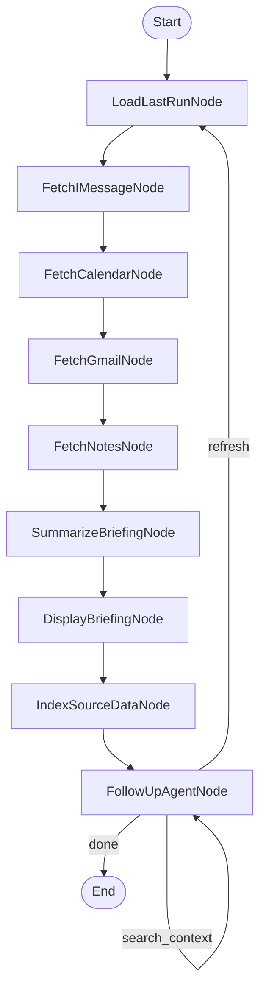

# Design Doc: RAG-Enhanced Follow-Up Agent

> AI NOTE: This is an **incremental change** to the existing life_admin codebase at https://github.com/hrm619/life_admin. Do NOT rewrite the briefing pipeline — it works. This doc describes modifications to the follow-up agent phase only, plus one new node and two new utility functions.

-----

## Problem

The `FollowUpAgentNode` currently serializes ALL raw source data (messages, emails, events, notes) into every LLM call. With heavy sources — especially Apple Notes, which can contain full documents — the context window fills up fast. This causes three issues: higher token costs, slower responses, and degraded answer quality as the model loses focus in a large context.

## Solution

Replace the "dump everything" approach with a RAG (Retrieval-Augmented Generation) pattern:

1. After the briefing is displayed, **index all raw source data** into an in-memory vector store using embeddings.
2. The follow-up agent's prompt gets the **briefing summary only** (compact) plus a **windowed conversation history** (last 10 exchanges).
3. When the agent needs raw detail to answer a question, it **retrieves only the relevant chunks** from the vector store via semantic search.
4. The agent gains a new action: `search_context` — a retrieval step it can take before answering. This creates a two-step pattern: search first, then answer with the retrieved context.

This is the PocketFlow **RAG design pattern** applied inside the agent loop.

-----

## Design Pattern

**Agent with tool-use (RAG retrieval as a tool)**

The agent's action space expands from 6 actions to 7. The new `search_context` action lets the agent search the indexed source data and loop back to itself with the retrieved results injected into the conversation history. This means the agent can do a retrieval step and then immediately answer on the next iteration — the user sees one response, but two LLM calls happened under the hood.

-----

## What Changes

### New Files

| File | Purpose |
|------|---------|
| `utils/embeddings.py` | Embedding utility — calls Anthropic Voyage or OpenAI embeddings API |
| `utils/vector_store.py` | In-memory vector store — wraps ChromaDB for chunk storage and semantic search |

### Modified Files

| File | What Changes |
|------|-------------|
| `nodes.py` | Add `IndexSourceDataNode`. Modify `FollowUpAgentNode` (prep, exec, post, and prompt). |
| `flow.py` | Insert `IndexSourceDataNode` between `DisplayBriefingNode` and `FollowUpAgentNode`. Add `search_context` edge on agent. |
| `pyproject.toml` | Add `chromadb` dependency. |

### Unchanged Files

Everything else stays the same: `main.py`, `utils/call_llm.py`, `utils/read_imessages.py`, `utils/fetch_calendar.py`, `utils/fetch_gmail.py`, `utils/read_notes.py`, `utils/state.py`, `utils/config.py`, `utils/format_briefing.py`, `utils/google_auth.py`.

-----

## Flow Diagram (modified)



The only structural changes are: `IndexSourceDataNode` inserted after `display`, and a new `search_context` self-edge on the agent.

-----

## New Utility Functions

### 1. get_embedding (`utils/embeddings.py`)

- **Input:** text (str)
- **Output:** list[float] — embedding vector
- Uses OpenAI's `text-embedding-3-small` via the `openai` package
- Includes a simple batching helper: `get_embeddings(texts: list[str]) -> list[list[float]]` for bulk embedding during indexing
- Reads `OPENAI_API_KEY` from environment (already in `.env`)
- **Fallback consideration:** If the embedding API is unavailable, the node should fall back gracefully — the agent can still work without RAG, just with truncated raw data like it does today

```python
# utils/embeddings.py
from openai import OpenAI

_client = None

def _get_client():
    global _client
    if _client is None:
        _client = OpenAI()  # reads OPENAI_API_KEY from env
    return _client

def get_embedding(text: str) -> list[float]:
    client = _get_client()
    response = client.embeddings.create(input=[text], model="text-embedding-3-small")
    return response.data[0].embedding

def get_embeddings(texts: list[str], batch_size: int = 2048) -> list[list[float]]:
    client = _get_client()
    all_embeddings = []
    for i in range(0, len(texts), batch_size):
        batch = texts[i:i + batch_size]
        response = client.embeddings.create(input=batch, model="text-embedding-3-small")
        # Response may not be in input order — sort by index
        sorted_embs = sorted(response.data, key=lambda x: x.index)
        all_embeddings.extend([e.embedding for e in sorted_embs])
    return all_embeddings
```

### 2. vector_store (`utils/vector_store.py`)

- **Purpose:** In-memory ChromaDB collection for the current session
- **Key functions:**
  - `create_index(chunks: list[dict]) -> chromadb.Collection` — takes chunked source data, embeds it, stores in a transient ChromaDB collection. Each chunk has metadata: `source` (imessage/gmail/calendar/notes), `sender`/`from`/`title` (for filtering), `date`, and the original `chunk_id`.
  - `search_index(collection, query: str, n_results: int = 5, where: dict = None) -> list[dict]` — semantic search with optional metadata filtering (e.g., only search iMessages, or only from a specific sender).
- **Chunking strategy:** Different sources get chunked differently:
  - **iMessages:** Each message is one chunk. Group consecutive messages in the same `chat_id` within a 5-minute window into a single chunk (to keep conversation fragments together).
  - **Emails:** Each email is one chunk. If email body > 2000 chars, split into chunks of ~1500 chars with 200-char overlap, preserving the email metadata on each chunk.
  - **Calendar events:** Each event is one chunk (events are already compact).
  - **Notes:** Split notes into chunks of ~1000 chars with 200-char overlap. Notes are the largest source and benefit most from chunking.
- **ChromaDB setup:** Use an ephemeral (in-memory) client — no persistence needed since we re-index each session.

```python
# utils/vector_store.py
import chromadb
from utils.embeddings import get_embeddings

def create_index(chunks: list[dict]) -> chromadb.Collection:
    """
    Each chunk: {"id": str, "text": str, "metadata": {"source": str, ...}}
    """
    client = chromadb.EphemeralClient()
    collection = client.create_collection(
        name="life_admin_session",
        metadata={"hnsw:space": "cosine"},
    )

    texts = [c["text"] for c in chunks]
    ids = [c["id"] for c in chunks]
    metadatas = [c["metadata"] for c in chunks]

    # Embed in batches
    embeddings = get_embeddings(texts)

    collection.add(
        ids=ids,
        embeddings=embeddings,
        documents=texts,
        metadatas=metadatas,
    )
    return collection


def search_index(collection, query: str, n_results: int = 5, where: dict = None) -> list[dict]:
    """
    Returns list of {"text": str, "metadata": dict, "distance": float}
    """
    from utils.embeddings import get_embedding
    query_embedding = get_embedding(query)

    kwargs = {
        "query_embeddings": [query_embedding],
        "n_results": n_results,
    }
    if where:
        kwargs["where"] = where

    results = collection.query(**kwargs)

    output = []
    for i in range(len(results["ids"][0])):
        output.append({
            "text": results["documents"][0][i],
            "metadata": results["metadatas"][0][i],
            "distance": results["distances"][0][i],
        })
    return output
```

-----

## New Node: IndexSourceDataNode

- **Type:** Regular Node
- **prep:** Read all raw source data from shared store: `shared["raw_messages"]`, `shared["raw_events"]`, `shared["raw_emails"]`, `shared["raw_notes"]`. Chunk each source according to the chunking strategy described above. Return the list of all chunks.
- **exec:** Call `create_index(chunks)`. Return the ChromaDB collection object. Use `max_retries=2`.
- **exec_fallback:** Return `None` and print a warning. The agent will fall back to truncated raw data if the index isn't available.
- **post:** Write the collection to `shared["vector_index"]`. Print chunk count: `f"[Index] Indexed {len(chunks)} chunks across {n} sources"`. Return `"default"`.

**Chunking logic (implement in prep):**

```python
def _chunk_messages(messages: list[dict]) -> list[dict]:
    """Group messages by chat_id, combine messages within 5-min windows."""
    chunks = []
    # Sort by chat_id then date
    # Group consecutive messages in same chat_id within 5 min
    # Each group becomes one chunk with text = "sender: body\nsender: body\n..."
    # metadata = {"source": "imessage", "chat_id": ..., "participants": ..., "date": <earliest>}
    return chunks

def _chunk_emails(emails: list[dict]) -> list[dict]:
    """Each email is one chunk; split long bodies with overlap."""
    chunks = []
    # For each email:
    #   header = f"From: {email['from']}\nSubject: {email['subject']}\nDate: {email['date']}"
    #   If body <= 2000 chars: one chunk with text = header + "\n\n" + body
    #   Else: split body into ~1500-char chunks with 200-char overlap
    #          each chunk gets the header prepended
    # metadata = {"source": "gmail", "from": ..., "subject": ..., "date": ...}
    return chunks

def _chunk_events(events: list[dict]) -> list[dict]:
    """Each event is one chunk."""
    # text = f"{event['title']} — {event['start']} to {event['end']}\nLocation: {event.get('location','')}\n{event.get('description','')}"
    # metadata = {"source": "calendar", "title": ..., "date": ...}
    return [...]

def _chunk_notes(notes: list[dict]) -> list[dict]:
    """Split notes into ~1000-char chunks with 200-char overlap."""
    chunks = []
    # For each note:
    #   header = f"Note: {note['title']} (folder: {note['folder']}, modified: {note['modified_date']})"
    #   Split note body into ~1000-char chunks with 200-char overlap
    #   Each chunk text = header + "\n\n" + chunk_text
    #   metadata = {"source": "notes", "title": ..., "folder": ..., "modified_date": ...}
    return chunks
```

-----

## Modified Node: FollowUpAgentNode

### Changes to prep()

**Remove:** The serialization of `raw_messages`, `raw_events`, `raw_emails`, `raw_notes` into the context dict.

**Add:** Read `shared["vector_index"]` (the ChromaDB collection, or None if indexing failed). Read `shared.get("retrieved_context", [])` — this is populated by the `search_context` action on previous iterations.

**Keep:** The `input()` call, shortcut detection for "done"/"refresh", conversation history, drafted replies, created tasks.

**Window the conversation history:** Only include the last 10 exchanges (20 items in the list). If there are more, prepend a one-line note: "(Earlier conversation omitted — {n} previous exchanges)"

### Changes to the agent prompt

Replace the current `AGENT_PROMPT` with a version that:

1. **Does NOT include raw source data.** The briefing JSON is the primary context.
2. **Includes retrieved context** if any was fetched via `search_context` on a previous iteration.
3. **Adds the `search_context` action** to the action space.

**New AGENT_PROMPT:**

```
AGENT_PROMPT = """Today's date: {current_date}

### Morning Briefing
{briefing_json}

### Retrieved Context
{retrieved_context}

### Conversation So Far
{conversation_history}

### Drafts Created This Session
{drafted_replies}

### Tasks Created This Session
{created_tasks}

## HANK'S INPUT
{user_input}

## ACTION SPACE

Decide the single best action. If Hank asks for specific details that aren't
in the briefing summary (exact wording of a message, full email body, specific
note contents), use search_context FIRST to retrieve the relevant data, then
answer on the next turn.

[1] answer
  Description: Answer Hank's question using the briefing and/or retrieved context
  Parameters:
    - response (str): Your answer

[2] search_context
  Description: Search the indexed source data for specific details before answering.
               Use this when the briefing summary doesn't have enough detail.
               After searching, you'll get another turn to answer with the results.
  Parameters:
    - query (str): Natural language search query (e.g. "Sarah's messages about dinner")
    - source_filter (str|null): Optional — limit search to one source: "imessage", "gmail", "calendar", or "notes". Use null to search all.
    - response (str): Brief message to show Hank while searching (e.g. "Let me look that up...")

[3] draft_reply
  Description: Draft a text message (iMessage) reply for Hank to send
  Parameters:
    - to (str): Recipient name
    - content (str): The draft message text
    - context (str): What this is replying to (one line)
    - response (str): Brief confirmation to show Hank

[4] draft_email
  Description: Draft an email reply for Hank to send
  Parameters:
    - to (str): Recipient email or name
    - subject (str): Email subject line
    - content (str): The draft email body
    - context (str): What this is replying to (one line)
    - response (str): Brief confirmation to show Hank

[5] create_task
  Description: Create a new task/to-do item based on what Hank said
  Parameters:
    - description (str): The task description
    - source (str): What triggered this
    - response (str): Brief confirmation to show Hank

[6] refresh
  Description: Re-pull all sources and regenerate the briefing
  Parameters:
    - response (str): Brief message confirming refresh

[7] done
  Description: Hank is finished with the briefing session
  Parameters:
    - response (str): Goodbye message with session summary

## RESPONSE FORMAT

Return ONLY valid JSON:
{{"action": "answer|search_context|draft_reply|draft_email|create_task|refresh|done", ...parameters from above}}"""
```

### Changes to exec()

No major changes — it still calls the LLM with the prompt and parses JSON. The only difference is the prompt is now smaller (no raw data) and includes `retrieved_context`.

### Changes to post()

Add handling for the new `search_context` action:

```python
elif action == "search_context":
    query = exec_res.get("query", "")
    source_filter = exec_res.get("source_filter")
    print(f"\n{exec_res.get('response', 'Searching...')}")

    # Perform the retrieval
    index = shared.get("vector_index")
    if index is not None:
        where = {"source": source_filter} if source_filter else None
        results = search_index(index, query, n_results=8, where=where)
        # Format results for injection into the next prompt
        formatted = []
        for r in results:
            src = r["metadata"].get("source", "unknown")
            formatted.append(f"[{src}] {r['text']}")
        shared["retrieved_context"] = formatted
    else:
        # Fallback: no index available
        shared["retrieved_context"] = ["(Index not available — could not search)"]

    # Add to conversation history
    shared["conversation_history"].append(
        {"role": "user", "content": prep_res["user_input"]}
    )
    shared["conversation_history"].append(
        {"role": "assistant", "content": f"(Searched for: {query})"}
    )
    return "search_context"
```

**Important:** After any non-`search_context` action, clear the retrieved context so it doesn't persist into unrelated questions:

```python
# At the top of post(), for all non-search actions:
if action != "search_context":
    shared["retrieved_context"] = []
```

-----

## Modified flow.py

```python
def create_flow() -> Flow:
    load = LoadLastRunNode()
    fetch_imsg = FetchIMessageNode(max_retries=2)
    fetch_cal = FetchCalendarNode(max_retries=2)
    fetch_gmail = FetchGmailNode(max_retries=2)
    fetch_notes = FetchNotesNode(max_retries=2)
    summarize = SummarizeBriefingNode(max_retries=3)
    display = DisplayBriefingNode()
    index = IndexSourceDataNode(max_retries=2)    # NEW
    agent = FollowUpAgentNode(max_retries=2)

    # Briefing pipeline
    load >> fetch_imsg >> fetch_cal >> fetch_gmail >> fetch_notes >> summarize >> display >> index >> agent

    # Agent loop
    agent - "answer" >> agent
    agent - "draft_reply" >> agent
    agent - "draft_email" >> agent
    agent - "create_task" >> agent
    agent - "search_context" >> agent              # NEW
    agent - "refresh" >> load
    # "done" has no successor — flow ends

    return Flow(start=load)
```

-----

## Shared Store Changes

**New keys added:**

```python
shared = {
    # ... all existing keys unchanged ...

    # NEW: populated by IndexSourceDataNode
    "vector_index": chromadb.Collection | None,  # the ChromaDB collection, or None if indexing failed

    # NEW: populated by search_context action, cleared after each non-search action
    "retrieved_context": list[str],  # formatted search results for injection into agent prompt
}
```

**Keys no longer read by FollowUpAgentNode's prep():**
- `raw_messages` — no longer serialized into the agent prompt (still in shared store for IndexSourceDataNode)
- `raw_events` — same
- `raw_emails` — same
- `raw_notes` — same

These keys are still populated by the fetch nodes and read by `IndexSourceDataNode` and `SummarizeBriefingNode`. They just aren't serialized into the agent's LLM prompt anymore.

-----

## Dependencies

Add to `pyproject.toml`:

```
chromadb
openai
```

Add to `.env`:

```
OPENAI_API_KEY=sk-...
```

-----

## Implementation Notes

### Build order
1. **First:** Implement and test `utils/embeddings.py` standalone. Verify you can embed a short string and get a vector back.
2. **Second:** Implement and test `utils/vector_store.py` standalone. Create a test index with 5 fake chunks, search it, verify results make sense.
3. **Third:** Implement `IndexSourceDataNode` in `nodes.py`. Run the full pipeline and verify the index gets created with the right chunk count.
4. **Fourth:** Modify `FollowUpAgentNode` — update the prompt, add `search_context` handling in post, add conversation windowing in prep.
5. **Fifth:** Update `flow.py` with the new node and edge.
6. **Last:** Test end-to-end. Verify that "What did Sarah say about dinner?" triggers a `search_context` action followed by an `answer` action.

### Graceful degradation
If embedding or ChromaDB fails (API key missing, network down, etc.):
- `IndexSourceDataNode.exec_fallback` returns `None`
- `shared["vector_index"]` is `None`
- `FollowUpAgentNode` detects this and falls back to including truncated raw data in the prompt (the current behavior, but with a character limit)
- The system still works, just without semantic search

### Conversation windowing
- Keep only the last 10 user/assistant pairs (20 items) in the conversation history sent to the LLM
- The full history remains in `shared["conversation_history"]` for the session summary
- Prepend a note if history was truncated: `"(Earlier conversation omitted — N previous exchanges)"`

### Embedding cost estimate
- OpenAI text-embedding-3-small: $0.02 per 1M tokens
- A typical session might have 500 chunks averaging 200 tokens each = 100K tokens = ~$0.002
- Negligible compared to the Claude API calls, and far cheaper than stuffing everything into the context

### Test scenarios
- **Direct briefing question:** "How many action items do I have?" → should `answer` directly from briefing, no search needed
- **Detail lookup:** "What exactly did Jake's email say?" → should `search_context` for Jake's email, then `answer` with the retrieved content
- **Source-filtered search:** "Show me my notes about project X" → should `search_context` with `source_filter: "notes"`
- **Draft after search:** "Reply to Jake and tell him yes" → should `answer` or `draft_email` if the context from a previous search is still available, or `search_context` first if it needs Jake's email context
- **Fallback:** If OPENAI_API_KEY is not set, agent should still work with truncated raw data
- **Long session:** After 15+ follow-up questions, verify conversation windowing keeps the prompt manageable
